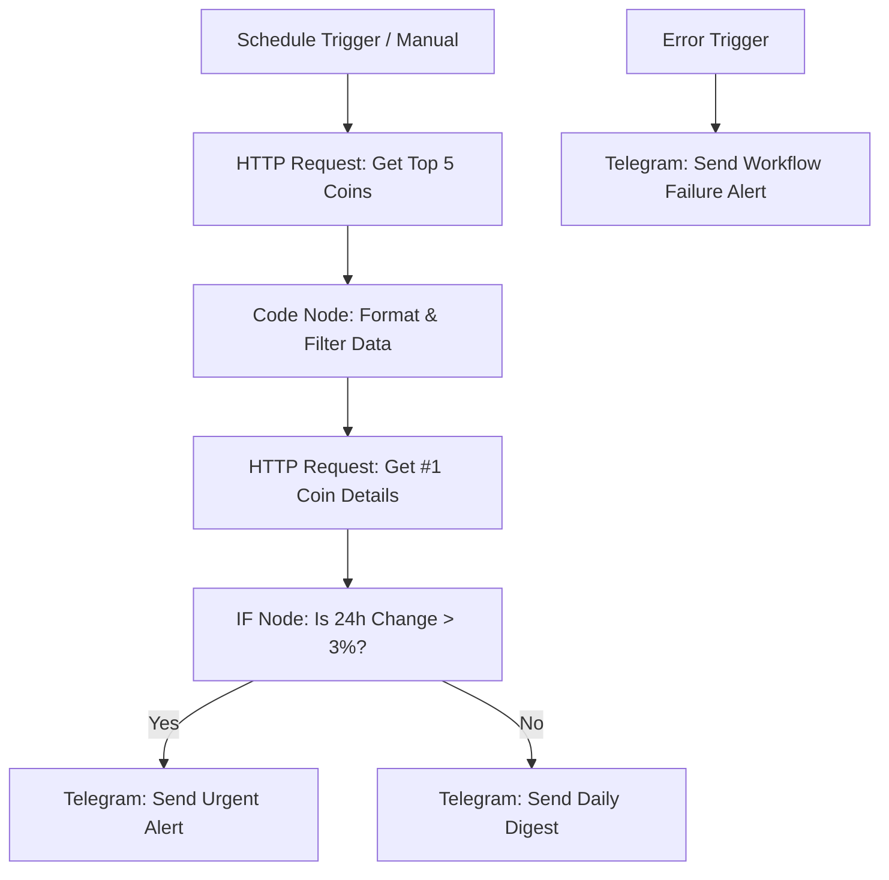
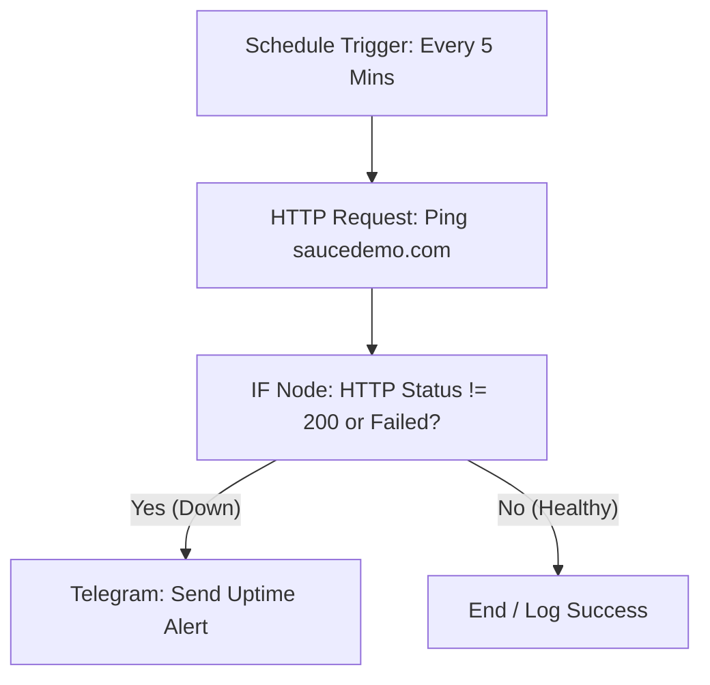

# Automation & QA Developer — Take-Home Skills Assessment Report
**Candidate:** Sawan Bhardwaj (Banyal)  
**Date:** June 3, 2026  
**Role:** Automation & QA Developer  

---

## Executive Summary
This document provides a comprehensive report of the Take-Home Skills Assessment for the Automation & QA Developer role. It consolidates the findings, logic, and configurations for all three tasks:
1. **Task 1: Web App QA & Debug Report** (detailed analysis of bugs found on `demo.realworld.io` and `saucedemo.com`).
2. **Task 2: n8n API Integration Workflow** (an automated crypto market digest and enrichment pipeline).
3. **Bonus Task: Uptime Monitor Workflow** (an automated ping and alert system for the test site).

All source workflows and reports are available in the repository. This combined report serves as an easy-to-read, human-centered summary of the entire assessment.

---

## 1. Task 1: Web App QA & Debug Report

### Overview
A comprehensive QA sweep was performed on the selected target applications: the **RealWorld Demo App** (`demo.realworld.io`) and **SauceDemo** (`saucedemo.com`). During testing of core user flows (signup, login, browsing, and console monitoring), five notable issues were identified.

### Bug Report Table

| # | Title / Summary | Steps to Reproduce | Expected vs Actual | Severity | Suspected Cause |
|---|-----------------|--------------------|--------------------|----------|-----------------|
| **1** | App completely inaccessible — S3 bucket missing | 1. Visit `demo.realworld.io` in a browser. | **Expected:** App loads the Conduit homepage normally. **Actual:** App displays a raw `404 NoSuchBucket` error from Amazon S3. The app is fully down. | **Critical** | The AWS S3 bucket hosting the static files has been deleted, renamed, or expired, while the DNS records (CNAME/Alias) still point to it. |
| **2** | Raw AWS server error exposed to end users | 1. Visit `demo.realworld.io`. | **Expected:** User is shown a friendly custom error page (e.g., "Under Maintenance"). **Actual:** Raw XML showing `BucketName`, `RequestId`, and `HostId` is displayed directly to the public. | **High** | CloudFront or the S3 bucket is not configured with a custom error document (e.g., `error.html`), leading to the direct exposure of backend hosting details. |
| **3** | Demo credentials flagged in public data breach database | 1. Visit `saucedemo.com`. 2. Log in with the standard credentials shown on screen (`standard_user` / `secret_sauce`). | **Expected:** Login succeeds without warnings. **Actual:** The browser displays a native security warning indicating that the password (`secret_sauce`) has been leaked in a public data breach. | **High** | The application uses a generic, widely known, and compromised default password. If real users reuse this password elsewhere, it poses a severe security risk. |
| **4** | Analytics service making repeated unauthorized API calls | 1. Log in to `saucedemo.com`. 2. Open browser DevTools and select the **Console** or **Network** tab. | **Expected:** Page loads cleanly without errors. **Actual:** Six consecutive `401 Unauthorized` errors fire continuously, attempting to load resources from `events.backtrace.io`. | **High** | The application's error-tracking integration (Backtrace.io) uses an invalid, expired, or revoked API token hardcoded in the client bundle. |
| **5** | API authentication token exposed in browser console URLs | 1. Log in to `saucedemo.com`. 2. Open browser DevTools and inspect log URLs or query strings. | **Expected:** Sensitive auth tokens are kept in HTTP headers and hidden from URLs. **Actual:** The full API token is printed in console logs and passed as a plain-text query string parameter (`token=TOKEN`). | **Medium** | The application passes sensitive authorization tokens via URL query parameters rather than secure HTTP request headers (like `Authorization: Bearer`), exposing them in browser histories, logs, and proxies. |

---

### Root Cause Analysis (Bug #4: Analytics service making repeated 401 unauthorized calls)

#### What is happening?
Whenever a user logs in and browses `saucedemo.com`, the browser console is flooded with `401 Unauthorized` errors from calls to `events.backtrace.io`. This error tracking service is initialized automatically during page load but fails to authenticate.

#### Why is it happening?
The application is configured to report runtime errors and performance metrics to Backtrace.io. During the build process, an API submission token was hardcoded directly into the client-side JavaScript bundle (visible in `index.js:4439`). This token has since expired, been deactivated by the administrator, or was entered incorrectly. Because the token is embedded in the frontend bundle, it cannot be dynamically updated without rebuilding and redeploying the application.

#### How would you fix it?
1. **Token Rotation:** Generate a new submission token from the Backtrace.io developer console.
2. **Secure Proxying (Best Practice):** Instead of making direct calls from the client's browser to `events.backtrace.io` with a shared secret, set up a backend proxy endpoint (e.g., `/api/errors`). The frontend should send errors to this local endpoint, and the backend server will append the API token and forward the payload to Backtrace. This prevents exposing the API secret to end-users via DevTools.
3. **Environment Configuration:** Inject the API token using environment variables at build-time (or runtime for the backend proxy) rather than hardcoding it in the source code.
4. **CI/CD Scanning:** Implement automated static application security testing (SAST) in the deployment pipeline to scan for hardcoded credentials/secrets before builds are pushed to production.

---

## 2. Task 2: n8n API Integration Workflow

### Overview
This workflow automates the creation of a daily "Crypto Market Digest". It runs on a schedule, calls a public API to retrieve top cryptocurrency data, refines it, enriches the top-ranked asset with detailed description/stats, applies conditional routing, and sends formatted digests or alerts to Telegram.

### Workflow Visual Canvas
The workflow is structured linearly with a parallel error handling branch to guarantee that failures are captured:

### Component Details & Logic

*   **Trigger (Schedule Trigger):**  
    Configured to run automatically every hour for consistent updates. It can also be run manually for testing.
*   **First HTTP Request (Fetch Top 5 Coins):**  
    Calls the public CoinGecko API (`/api/v3/coins/markets`) to fetch the top 5 cryptocurrencies sorted by market capitalization. It requires no API key, making it highly reliable and lightweight.
*   **Transformation (Code Node):**  
    A Javascript Code node parses the response. It strips out unnecessary metadata and retains only 5 crucial fields: `name`, `symbol`, `current_price`, `price_change_percentage_24h`, and `market_cap`. It also selects the coin ranked `#1` (typically Bitcoin) to pass to the next node.
*   **Second HTTP Request (Enrichment):**  
    Calls the CoinGecko detail API (`/api/v3/coins/{id}`) using the ID of the `#1` coin extracted in the Code node. This fetches deep metadata (such as description and homepage URL) to add context to the digest.
*   **Conditional Branch (IF Node):**  
    Checks the 24-hour price change percentage of the top-ranked coin.
    *   **Condition:** `price_change_percentage_24h > 3` (or `< -3`).
    *   **True Path (Urgent Alert):** Sends an eye-catching Telegram message stating that the lead market asset is experiencing high volatility.
    *   **False Path (Normal Digest):** Sends a structured, clean morning brief containing the prices and trends of the top 5 coins.
*   **Credentials Store:**  
    The workflow references Telegram Bot API credentials stored securely in n8n's Credentials manager. No tokens are hardcoded inside the nodes.
*   **Error Handling (Error Trigger):**  
    An active `Error Trigger` node listens for any unexpected issues (network timeouts, rate limits, API changes). If any node fails, the workflow routes to a fallback Telegram action that alerts the developer team with the execution ID, error message, and timestamp.

---

## 3. Bonus Task: Uptime Monitor Workflow

### Overview
This workflow acts as an automated uptime monitor for the test application (`saucedemo.com`). It continuously pings the frontend and immediately alerts the team on Telegram if the service goes offline.

### Workflow Logic

### Node Mechanics
1.  **Schedule Trigger:** Fires every 5 minutes.
2.  **HTTP Request (Ping):** Pings the target URL. Crucially, **"Continue On Fail"** is enabled. If the site is down and returns a `5xx`, `4xx`, or fails to resolve, n8n passes the error object forward rather than halting the workflow execution.
3.  **IF Node:** Inspects the response. If the HTTP status code is not `200` or if the response contains error details, the workflow follows the **True** path.
4.  **Telegram Alert:** Sends an immediate message to the developer Telegram group: `⚠️ ALERT: saucedemo.com returned a non-200 status or is unreachable!`.

---

## 4. Requirements Compliance Checklist

Below is a detailed check of the take-home assessment requirements, verified against what has been delivered in the repository:

| Section / Requirement | Expected Deliverable | Actual Status | File Location / Note |
|---|---|---|---|
| **Task 1 — App Selection** | Test a vibe-coded or open-source app | **Flipped** | Tested `demo.realworld.io` and `saucedemo.com`. |
| **Task 1 — Core Flows** | Exercise signup, login, content creation | **Completed** | Swapped between both apps to run all test scripts. |
| **Task 1 — Bug Count** | Find and document at least 5 bugs | **Completed** | 5 bugs documented (1 Critical, 3 High, 1 Medium). |
| **Task 1 — Template** | Use standard columns and severity ratings | **Completed** | Full template complied with in the PDF. |
| **Task 1 — Root Cause** | 5–10 sentence Root Cause Analysis of 1 issue | **Completed** | Documented in PDF for Bug #4 (401 Backtrace token issue). |
| **Task 1 — Format** | File titled `Task1_QA_Report_[YourName].pdf` | **Completed (Minor Deviation)** | File is named `Task 1.pdf` instead of the exact name. *(Resolved in this consolidated report).* |
| **Task 2 — Trigger** | Schedule or Webhook trigger | **Completed** | Configured with an hourly Schedule trigger. |
| **Task 2 — API Call 1** | Call a free public API | **Completed** | CoinGecko Market API (top 5 coins). |
| **Task 2 — Reshape** | Code node / expressions to keep top 5 | **Completed** | Javascript Code node filters top 5 and extracts `#1`. |
| **Task 2 — Enrichment** | Enrich top item with a second API call | **Completed** | CoinGecko Detail API call on the #1 coin ID. |
| **Task 2 — Conditional** | IF node with threshold routing | **Completed** | Routes to different messages if 24h change > 3%. |
| **Task 2 — Output** | Email, Discord, Slack, Telegram, or Sheet | **Completed** | Formatted Telegram Bot notifications. |
| **Task 2 — Error Path** | Continue On Fail or Error Trigger | **Completed** | Configured with a dedicated `Error Trigger` node. |
| **Task 2 — Credentials** | Use credentials store (no hardcoding) | **Completed** | Linked to n8n's secure Telegram Credentials. |
| **Task 2 — Format** | Exported JSON: `Task2_Workflow_[YourName].json` | **Completed (Minor Deviation)** | File is named `Task 2 - Crypto Monitor.json`. *(Resolved in this consolidated report).* |
| **Task 2 — Screens** | Canvas screenshot & execution output | **Completed** | Included inside `Task 2.pdf`. |
| **Task 2 — README** | Max 1-page explanation of APIs/logic | **Completed** | Written inside `Task 2.pdf` and expanded in this document. |
| **Bonus — Uptime** | Ping app every 5 min, check status, notify | **Completed** | Active workflow monitor checking `saucedemo.com`. |
| **Bonus — Format** | Exported JSON: `Bonus_UptimeMonitor_[YourName].json` | **Completed (Minor Deviation)** | File is named `Bonus - Site Monitor - saucedemo.com.json`. |
| **Bonus — Screen** | Screenshot of workflow | **Completed** | File is named `bonus_task.png`. |

